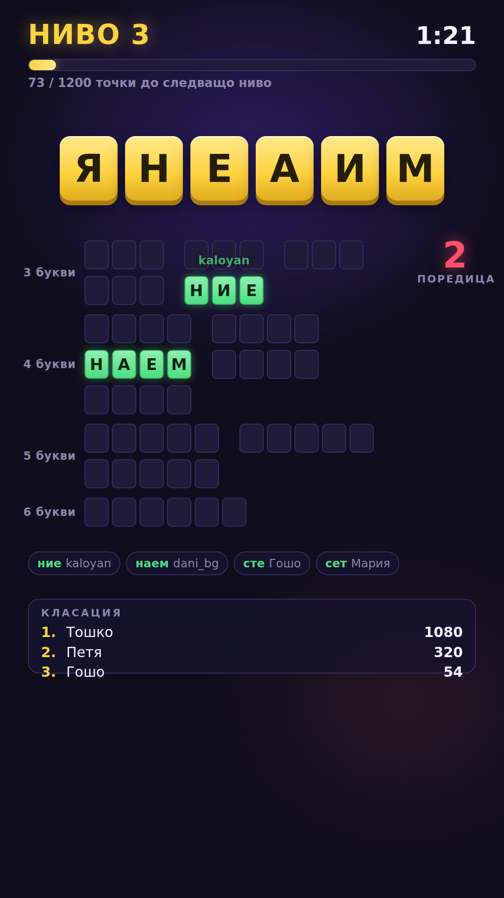
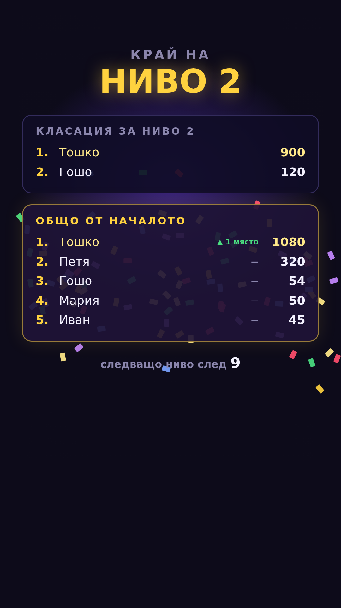

# Думички — Words On Stream за TikTok Live

Българска игра с разбъркани букви за TikTok Live. Стойка от букви на екрана,
зрителите пишат думи в чата, познатите се разкриват и носят точки.

Работи като OBS browser source, вертикално 1080x1920. Чист HTML/CSS/JS —
без build стъпка, без компилация, без облак.

## Състояние

| Етап | Какво | Състояние |
|------|-------|-----------|
| 1 | Речник — скрипт и `words.json` | готов |
| 2 | Ядро: стойки, subset търсене, шльокавица | готов |
| 3 | TikTok връзка | готов |
| 4 | Интерфейс и анимации | готов |
| 5 | Сглобяване и конфигурация | готов |

---

## Бърз старт

> Ако това ти е първият път: **[КАК-ДА-ГО-ПУСНА.md](КАК-ДА-ГО-ПУСНА.md)** е
> същото, но стъпка по стъпка, с картинки на папките и какво да натиснеш.

**Двоен клик върху `1-ПРОБА-БЕЗ-СТРИЙМ.bat`** — играта тръгва веднага с
измислени зрители. За стрийма са `2-ПУСНИ-МОСТА.bat` и `3-ПУСНИ-ИГРАТА.bat`.

Не иска инсталация, Python, интернет или ключове. Речникът и звуците са в
репото.

Играта чете от **моста** по подразбиране. Ако той не върви, най-долу на
екрана пише защо — в зоната, която TikTok закрива, така че зрителите не го
виждат.

1. `2-ПУСНИ-МОСТА.bat` — първия път пита за TikTok името ти и инсталира
   зависимостите; остави черния прозорец отворен
2. Отвори `game/chat-test.html`, натисни **TikTokLive мост** и напиши нещо
   в чата на стрийма
3. Добави browser source **1080 × 1920** към `game/index.html`

**Защо не TikFinity**, въпреки анализа по-долу: локалният му WebSocket го
има само в десктоп приложението. Уеб версията не може да отвори сокет на
твоята машина, а точно нея ползва стриймърът тук. Адаптерът остава — ако
някой ползва десктоп версията, смяната е един ред.

За проба без стрийм: `1-ПРОБА-БЕЗ-СТРИЙМ.bat` или
`game/index.html?source=mock` — измислени зрители познават думи сами.

Ако нещо не тръгне, виж „Пускане в TikTok Studio" по-долу.

---

## Решение по връзката с TikTok: зад адаптер

> **Как свърши на практика:** избрах TikFinity по причините отдолу, но се
> оказа, че локалният му WebSocket го има само в десктоп приложението, а
> стриймърът ползва уеб версията. Уеб страница не може да отвори сокет на
> чужда машина. Минахме на моста — и точно затова връзката беше зад
> адаптер: смяната беше един ред плюс скрипт за пускане, а нищо в играта
> не се пипна. Анализът отдолу си остава, включително частта, в която
> сгреших.

**Първоначален избор: TikFinity WebSocket, но играта не знае за него.**

Разглежданите варианти бяха TikFinity WebSocket и TikTokLive (Python) с локален
WebSocket мост. Разликата между тях е една и същата на пръв поглед — и двата
дават събития в браузъра — но чупливостта им е много различна.

TikTok не публикува протокола на Webcast и го променя без предупреждение.
Всяко решение трябва да подписва заявките си срещу движеща се цел. Въпросът не
е кой вариант е по-елегантен, а **чий проблем е поддръжката на подписването**:

- **TikTokLive + мост** — подписването минава през външен signing сървър
  (Euler Stream) с лимити на безплатния слой и нужда от ключ над тях. Когато
  TikTok смени нещо, стриймът спира, докато библиотеката излезе с нова версия
  и ти обновиш зависимостите. Отгоре на това: Python среда, зависимости и още
  един процес, който трябва да работи по време на стрийм.
- **TikFinity** — същият проблем, но решаван от екип с платена инфраструктура,
  който го прави за хиляди стриймъри едновременно. Излага локален WebSocket на
  `ws://localhost:21213/`, който говори чист JSON. Няма Python, няма
  зависимости, няма одобрен developer акаунт.

Решаващото: **вече го ползваш в друг overlay и работи.** Работеща връзка в
твоя реален setup тежи повече от всякакъв теоретичен аргумент.

Единственият сериозен довод срещу TikFinity е зависимостта от трета страна —
ако утре смени схемата или сложи функцията зад платен план, оставаш блокиран.
Затова връзката е **зад адаптер**: ядрото на играта приема само нормализирано
събитие

```js
{ user: "име", message: "текст", timestamp: 1699999999 }
```

и не знае откъде идва. Адаптерите са три, сменят се с един ред в конфигурацията:

- `tikfinity` — основният, WebSocket към локалния TikFinity
- `tiktoklive` — резервен, същия протокол от Python мост
- `mock` — писане в конзолата, за разработка без жив стрийм

Така рискът от заключване в трета страна отпада, а печелим надеждността ѝ.
Ако TikFinity падне по време на стрийм, смяната е конфигурационна, не пренаписване.

---

## Етап 1 — Речник

```bash
python3 tools/build_dictionary.py
```

Пуска се **веднъж, преди стрийма.** Сваля hunspell речника за български
(BGoffice), разгъва афиксите и записва готовите файлове. По време на игра се
четат само те — никакви заявки към интернет.

### Какво произвежда

| Файл | Размер | За какво |
|------|--------|----------|
| `data/words.json` | 6.3 MB, 353 801 думи | проверка "тази дума съставя ли се от буквите на стойката" |
| `data/common.json` | 529 KB, 31 986 думи | избор на семе и на целеви думи, подредени по честота |
| `data/words.stats.json` | — | статистиката от последното пускане |

**Защо два файла.** Речникът съдържа `глумящо`, `сопаш`, `гариращ`, `преръся` —
валидни форми, които никой зрител няма да напише. Ако целите за рунда се теглят
равномерно от всички находки, половината рунд е непознаваем и играта умира.
`common.json` е сечението с честотен списък от субтитри (OpenSubtitles 2018) —
точно регистърът, на който се пише в TikTok чата. Пълният речник остава за
проверката на догадките; честият — за избора какво да търсим.

### Обработка

Афиксите се разгъват от собствен hunspell разгъвач (`unmunch` е ненадежден при
сложни .aff файлове). Поддържа PFX/SFX, кръстосано произведение, `FLAG
long/num`, `AF` псевдоними и regex условията на hunspell — българският .aff не
ползва повечето, но при смяна на речник няма да се счупи.

Изхвърля се: главни букви (собствени имена), съкращения, тирета, апострофи,
думи под 3 букви, всичко извън 30-те букви на българската азбука. Нормализира
се до NFC, за да отпадне `ѝ` в разложен вид.

### Опции

```
--max-len N     максимална дължина (по подразбиране 9)
--min-len N     минимална дължина (по подразбиране 3)
--offline       ползва кеша в data/source/, не сваля
--no-frequency  без честотен списък (не се препоръчва)
```

По подразбиране се спира на 9 букви. Стойката е 6–7, тоест 8- и 9-буквените
думи не могат да се съставят от нея — държим ги само като запас, ако решиш да
вдигнеш размера на стойката от конфигурацията. Без този таван речникът е
874 хиляди думи и 22 MB.

### Резултат

```
Основи в hunspell речника :    78238
  от тях собствени имена  :     5998
Генерирани словоформи     :   886538
Думи в изхода             :   353801

  3 букви :     714      6 букви :   32302      9 букви :  135620
  4 букви :    3297      7 букви :   65021
  5 букви :   12387      8 букви :  104460

Чести думи                :    31986   (9.0% от речника)
Семена 6-7 букви, чести   :    13276
```

---

## Етап 2 — Ядро

Играта без интерфейс. Пет модула в `game/js/core/`, всеки работи и като
`<script>` в браузъра, и като `require()` в тестовете.

```bash
node tools/test_core.js     # 55 теста
```

| Модул | Какво прави |
|-------|-------------|
| `normalize.js` | съобщение от чата → чисти букви |
| `shlyokavitsa.js` | кирилска дума → всички латински изписвания |
| `dictionary.js` | речникът и търсенето "кои думи се съставят от тези букви" |
| `stack.js` | тегли и валидира стойката, избира целите |
| `round.js` | връзва трите: рунд с индекс за познаване |

**Ред на зареждане.** Модулите се закачат на `window.Dumichki` и се четат
при зареждане, така че редът е задължителен: данните, `normalize`,
`shlyokavitsa`, `dictionary`, `stack`, `round`. Грешен ред гърми веднага и
шумно, не тихо.

### Търсенето по стойка

Наивно е да минем през 113 хиляди думи и да броим буквите на всяка.
Вместо това всяка дума се индексира по **подпис** — буквите ѝ, сортирани.
`роза` и `зора` имат един подпис, `азор`. За стойка от 7 букви генерираме
подписите на всичките ѝ подмножества — най-много 127 — и правим 127
търсения в хеш.

Резултат: **0.03 ms на стойка**. Кръстосано проверено срещу наивния метод,
съвпада дума по дума.

Подписът се смята със сортиране чрез вмъкване вместо `split().sort().join()`
— при думи до 7 букви е 9 пъти по-бързо, което сваля стартовото индексиране
от 721 на 166 ms. Има значение, ако OBS изключва source-а при смяна на сцена.

### Шльокавица

Посоката е обърната. Не гадаем латиница → кирилица (там `c` може да е к, с
или ц, а `j` може да е ж или й). Вместо това за всяка от 10-14-те цели
разгъваме всички правдоподобни изписвания и ги слагаме в индекс. Проверката
е едно търсене в хеш.

Разгъването на една дума дава 8-32 варианта, най-лошият случай остава под
20 хиляди. Прави се веднъж на рунд за шепа думи.

```
яко     → qko, yako, iako, jako, qco, ...
човек   → 4ovek, chovek, covek, 4owek, ...
сърце   → sarce, srce, surce, syrce, sarts, ...
кръв    → krv, krav, kruv, kryv, crv, ...
дъщеря  → da6terq, dashteria, d6terya, ...
```

Сблъсъците се очакват — `san` е и `сън`, и `сан` — затова индексът пази
списък и при познаване се взима първата ненамерена дума.

### Нормализация

Проверяват се два вида кандидати: цялото съобщение без интервали (хваща
`q k o` и `с ъ р ц е`) и всяка дума поотделно, до 6 (хваща `мисля че е яко`).
Емоджита, пунктуация и водещи `@споменавания` падат. В латиница се пазят
само буквите и цифрите `4` и `6` — те са букви, всичко останало е шум.

### Стойката

Тегли се семе от 6-7 букви измежду **честите** думи, буквите му стават
стойката. Оттам има гарантиран поне един пълен отговор. Проверките са
подредени от евтина към скъпа — гласните и редките букви се броят наум,
търсенето идва накрая. Средно **1.3 опита на стойка, 0.3 ms на рунд.**

Целите не са просто най-честите намерени думи: върви се в кръг по
дължините, най-дългите първи. Иначе целите излизат само от 3 и 4 букви
(късите думи са по-чести) и рундът остава без нито една дълга дума — а
точно те носят точките и ефектите.

```
Т Д А П О А Т  (отпадат)
   ада, под, топ, дата, пада, пода, падат, потта, отпада, отпадат
Х Ъ С Т И Р  (търсих)
   рис, сър, тих, три, хит, ръст, стих, търси, хитър, търсих
А Т Е Ю Л Ч К  (кюлчета)
   ела, люк, чак, ключ, лека, тела, чета, ключа, четка, кюлчета
```

### Две отклонения от заданието

**Праговете се броят по честите находки, не по всички.** Стойка с 20
находки, от които 16 са `зер`, `мър` и `зре`, формално минава проверката
"8-25 намираеми думи", но е мъртъв рунд — точно случаят `мързел`, който
показах на етап 1.

**Горният праг е 40, не 25.** След като се брои по честите думи,
разпределението е: медиана 20, p90 33. Праг 25 отрязва 27% от стойките, а
те не са лоши — просто богати, и понеже показваме само 10-14 цели,
излишъкът не се вижда на екрана. Дава по-добър избор откъде да теглим
целите. Ако предпочиташ буквата на заданието, `maxPlayable` е настройка.

### Данните са `.js`, не `.json`

OBS зарежда browser source през `file://`, където `fetch()` към локален
файл се блокира от CORS. Script таговете не минават през тази проверка,
затова `build_dictionary.py` произвежда и `game/data/dictionary.js` — 1.7 MB,
думите от 3 до 7 букви плюс честотната подредба. `words.json` остава като
канонични данни за инструментите.

Ако вдигнеш размера на стойката в конфигурацията, пусни скрипта наново с
`--runtime-max-len`.

---

## Етап 3 — Връзката с чата

```bash
python3 tools/test_chat.py     # 21 теста, истински Chromium
```

Отвори `game/chat-test.html` в браузър (или като browser source) и коментарите
влизат в конзолата. Източникът се избира от адреса:

```
game/chat-test.html?source=mock          мним чат, без нищо друго
game/chat-test.html?source=tikfinity     TikFinity на localhost:21213
game/chat-test.html?source=tiktoklive    мостът на localhost:21214
game/chat-test.html?source=tikfinity&debug=1     показва суровите кадри
```

### Устройство

Ядрото не знае откъде идват съобщенията. Знае само това:

```js
{ user: "Име", userId: "123", message: "текст", timestamp: 1699999999999 }
```

Всичко останало живее в `game/js/chat/`: `chat.js` е машинарията (събития,
вдигане на връзката, отсяване на дубликати), а трите `adapter-*.js` знаят
по една схема всеки.

`chat.js` носи две неща, които се появяват чак на живо. Първото е
**вдигане на връзката** с изкачващо се изчакване от 1 до 15 секунди с
разсейване — стриймът върви с часове и сокетът ще падне поне веднъж.
Второто е **отсяване на дубликати** по `msgId`: TikTok понякога праща едно
съобщение два пъти, а двойно броене значи двойни точки.

### Какво е проверено наистина

Тестът вдига фалшив TikFinity, пуска **истински Chromium** и зарежда
overlay-а през `file://` — точно както прави OBS. Проверява целия път, не
парчета от него:

```
✓ страницата се зарежда без грешки       ✓ подаръци и лайкове се пропускат
✓ речникът е зареден през file://        ✓ повторените съобщения се отсяват
✓ играта се закачи за сокета             ✓ догадка на кирилица се хваща
✓ името и текстът са разчетени           ✓ догадка на шльокавица се хваща
✓ падането на сървъра се забелязва       ✓ грешните се пропускат тихо
✓ връзката се вдига сама                 ✓ мнимите зрители познават думи
```

Че `fetch()` към локален JSON нямаше да мине, беше предположение на етап 2.
Сега е проверено: страницата зарежда 113 721 думи през `file://` без
никакъв CORS проблем, защото са `.js`.

### Какво НЕ е проверено

**Схемата на TikFinity.** Тестът върви срещу фалшив сървър, който пише
кадрите така, както ги описва TikFinity. Твоят TikFinity може да ги пише
малко другояче. Затова адаптерът чете полетата търпимо — пробва
`comment`/`message`/`text` за текста, `nickname`/`uniqueId`/`displayName` за
името — и затова има `debug=1`. Отвори страницата с него, погледни един
суров кадър в конзолата и ще стане ясно за трийсет секунди. Ако имената се
разминават, поправката е един ред в `adapter-tikfinity.js`.

**Връзката на моста към живия TikTok.** Мостът вдига сокета си, приема
браузъри и не пада при отказ — това е проверено. Самото закачане за стрийм
не е: средата тук няма достъп до TikTok.

### Мнимият чат не е играчка

`?source=mock` ражда трафик, който прилича на истински: повечето съобщения
са боклук, около 40% са догадки, а близо половината от тях са на
шльокавица. Точно с това ще се прави интерфейсът на етап 4, без да пускаш
стрийм за всяка промяна.

За проверка и на самия сокет има `tools/fake_tikfinity.py`:

```bash
python3 tools/fake_tikfinity.py --words роза зора азот
python3 tools/fake_tikfinity.py --interactive    # каквото напишеш, влиза в играта
```

А от конзолата на browser source-а работи и `chat.say("иван", "яко")`.

### За моста

`bridge/tiktok_bridge.py` е резервният път. Едно наблюдение оттук, което
подкрепя избора от точка 1: TikTokLive 6.6.6 още влачи `protobuf3-to-dict` —
изоставен пакет от 2018, който не се компилира на съвременен Python.
Инсталацията му се счупи в тази среда и мина само със заобикаляне. Такива
неща се случват насред стрийм.

---

## Етап 4 — Интерфейс и анимации

```bash
python3 tools/test_overlay.py     # 43 теста, истински Chromium на 1080x1920
```

Отвори `game/index.html`. Работи веднага — по подразбиране с мнимия чат, без
да е нужен стрийм.



### Оформлението

Зоните са премерени спрямо това, което TikTok закрива — долните ~480 px и
дясната лента. Нищо не слиза под 1440 px, и това е проверено в теста, а не
на око:

```
  40 - 210     ниво, прогрес до следващо, таймер
 250 - 470     стойката
 500 - 1140    слотовете с думите        <- най-важната зона
 508 - 640     броячът на поредицата (в дясната колона)
1168 - 1240    лента с последните познати
1280 - 1440    класация топ 3
  под 1440     нищо
```

Броячът на поредицата първо беше горе вдясно и падаше точно върху
седмата плочка на стойката. Личи се само на снимка — затова тестът вече
сравнява двата правоъгълника.

### Усещането при познаване

Буквите излитат от стойката и се приземяват в слота една по една, със 70 ms
разлика, по дъга нагоре и с отскок в края. Всяка тръгва от **истинската
плочка със същата буква**, а не от произволна — окото хваща разликата
веднага. Ползва се Web Animations API, не CSS класове, защото дъгата иска
междинен кадър.

Останалото: звук с покачваща се височина за всяка следваща дума от
поредицата (един файл, транспониран със скоростта на пускане), име на
позналия, което изскача и избледнява за 3 секунди, тресене на екрана при
дума от 6-7 букви, брояч на поредицата, който подскача при всяко
покачване.

Разбъркването на стойката е FLIP — запомняме къде са плочките, пренареждаме
ги, връщаме ги наглед по старите места и ги пускаме да се плъзнат.

### Паузата между нивата



Двете класации, една под друга. Горе нивото, което току-що свърши; долу
общата от началото. Редовете влизат един по един **отдолу нагоре** — от
пето към първо място.

Общата класация е с златен кант и лек ореол, защото тя е тази, за която се
играе през цялото време, и трябва да личи от пръв поглед коя от двете е.

Три неща излязоха чак когато погледнах снимката:

- **Конфетите закриваха точно имената.** Сега минават зад панелите — видими
  са около тях и прозират през полупрозрачния фон, но не пречат на четенето.
- **При първото ниво всички пет реда пишеха „нов".** Пет пъти „нов" не казва
  нищо; сега стрелките се появяват от второто класиране нататък, когато вече
  има с какво да се сравнява.
- Заглавието на панела повтаряше голямото „НИВО 1" отгоре.

Конфети има само тук — на етап 9 от заданието пишеше да се пази за края на
нивото, и това е причината да не се обезценят.

### Звуците

`game/audio/` — седем файла, произведени от `tools/make_sounds.py` (чист
синтез, без външни библиотеки). Сменят се със свои, стига имената да са
същите: `word`, `hint`, `shuffle`, `level-up`, `round-end`, `round-clear`,
`countdown`. Играта не знае какво свири.

### Проверки от адреса

```
index.html?safe=1      показва границите, които TikTok закрива
index.html?mute=1      без звук
index.html?source=mock мним чат, независимо какво пише в config.js
index.html?debug=1     суровите кадри от чата в конзолата
```

---

## Пускане в TikTok Studio (или OBS)

Важното първо: **чатът не минава през програмата, с която стриймваш.**

```
   TikTok - твоят стрийм
        │  TikFinity чете коментарите оттук, по потребителско име
        ▼
   TikFinity - приложение на твоя компютър
        │  ws://localhost:21213
        ▼
   Думички - браузър източник
        │  само картина
        ▼
   TikTok Studio  ──►  обратно в стрийма
```

TikFinity се закача за стрийма ти откъм TikTok, а не откъм програмата на
компютъра. Затова е все едно дали излъчваш с OBS, с TikTok Studio или с
нещо друго — пътят на чата е същият.

### Стъпки

1. Пусни TikFinity и го свържи с акаунта си. Трябва да върви, докато
   стриймваш.
2. В `game/config.js` сложи `source: "tikfinity"`.
3. Добави браузър източник с размер **1080 × 1920** и го насочи към играта.
4. Провери схемата веднъж: отвори `chat-test.html?source=tikfinity&debug=1`,
   напиши нещо в чата на стрийма и виж дали се появява.

### Разликата между OBS и TikTok Studio

Тя е само в трета стъпка — как браузър източникът стига до файла.

**OBS** има отметка „Local file" и приема пътя направо. Затова данните са
`.js`, а не `.json` — през `file://` заявките към локален файл се блокират
от CORS, а script таговете минават.

**TikTok Studio** иска адрес. Не съм проверявал дали приема `file:///C:/...`
— нямам достъп до него оттук. Ако не приема, пусни:

```bash
python3 tools/serve.py
```

и подай `http://127.0.0.1:8080/index.html`. Сървърът слуша само на твоята
машина и не праща нищо навън. Играта е проверена, че върви и по двата пътя
— през файл и през HTTP.

### Ако браузър източник не свърши работа

Отвори `index.html` в Chrome или Edge, свий прозореца до вертикален и го
хвани с „Window capture". Работи навсякъде, но звукът е по-труден за
насочване.

### Звукът

В OBS звукът от браузър източник влиза в стрийма (има „Control audio via
OBS"). Дали TikTok Studio прави същото за своя браузър източник — не съм
проверявал. Ако не влезе, пусни играта с `?mute=1` и остави звуковото
оформление на музиката, която пускаш.

---

## Етап 5 — Конфигурация

Всичко се пипа в **`game/config.js`**. Никой друг файл не се редактира. След
промяна: обнови browser source-а.

```bash
python3 tools/test_all.py      # всички тестове наведнъж
python3 tools/test_config.py   # само конфигурацията, 17 теста
```

### Ако сгрешиш нещо

Конфигурацията се проверява **преди играта да тръгне**, и грешката излиза
на екрана с думи:

```
Грешка в config.js
stack.seedLengths иска стойка от 8 букви, но речникът е построен
до 7. Пусни отново:
    python3 tools/build_dictionary.py --runtime-max-len 8
```

Това не е украса. Тази точно настройка изглежда напълно разумна, а без
проверката играта се върти в празни опити и overlay-ът остава черен —
разбираш за това чак на живо. Съмнителните, но допустими стойности минават
като предупреждение в конзолата.

### Чат

| Настройка | По подразбиране | Какво прави |
|---|---|---|
| `chat.source` | `"mock"` | `tikfinity`, `tiktoklive` или `mock` |
| `chat.host` | `"localhost"` | къде слуша източникът |
| `chat.port` | `null` | празно = портът по подразбиране за източника (21213 / 21214) |
| `chat.debug` | `false` | показва суровите кадри в конзолата |
| `chat.cooldown` | `8` | секунди, преди същият зрител да познае пак |

`cooldown` е задължителен, не украса: без него един човек с анаграм солвър
изяжда целия рунд сам.

### Рунд

| Настройка | По подразбиране | Какво прави |
|---|---|---|
| `round.duration` | `90` | секунди на рунд |
| `round.hintAfter` | `25` | секунди без успех до автоматичен намек |
| `round.shuffleEvery` | `15` | секунди между разбъркванията на стойката |
| `round.gap` | `5` | пауза след рунда, в която се показват непознатите думи |

### Нива

| Настройка | По подразбиране | Какво прави |
|---|---|---|
| `level.baseThreshold` | `800` | точки за първото ниво |
| `level.thresholdGrowth` | `200` | с колко расте прагът всяко следващо |
| `level.intermission` | `10` | секунди пауза с двете класации |

### Точки

| Настройка | По подразбиране | Какво прави |
|---|---|---|
| `scoring.pointsPerLetter` | `10` | базово: дължина × това |
| `scoring.speedWindow` | `5` | секунди от началото на рунда с бонус |
| `scoring.speedBonus` | `1.5` | множител в тези секунди |
| `scoring.streakStep` | `0.1` | + толкова за всяка дума от поредицата |
| `scoring.streakMax` | `2.0` | таван на множителя (1.0 = без множител) |
| `scoring.streakTimeout` | `15` | секунди без успех, след които поредицата пада |

### Стойка

| Настройка | По подразбиране | Какво прави |
|---|---|---|
| `stack.seedLengths` | `[6, 7]` | от колко букви е стойката |
| `stack.targetsMin` / `targetsMax` | `10` / `14` | колко думи се търсят в рунд |
| `stack.minPlayable` / `maxPlayable` | `10` / `40` | колко чести думи да се съставят от стойката |
| `stack.minVowels` | `2` | гласни в стойката (`ъ` се брои за гласна) |
| `stack.maxRareLetters` | `1` | колко от `ф щ ь ю ц` се търпят |

**Ако вдигнеш `seedLengths` над 7**, речникът трябва да се построи наново:

```bash
python3 tools/build_dictionary.py --runtime-max-len 8
```

Иначе играта спира с обяснение, вместо да замръзне.

### Класации и лента

| Настройка | По подразбиране | Какво прави |
|---|---|---|
| `board.inGame` | `3` | реда в класацията по време на игра (има място за ~5) |
| `board.intermission` | `5` | реда във всяка от двете класации в паузата |
| `board.ticker` | `4` | последни познати думи в лентата |

### Звук

| Настройка | По подразбиране | Какво прави |
|---|---|---|
| `audio.enabled` | `true` | изключва всички звуци |
| `audio.volume` | `0.55` | 0 до 1 |
| `audio.folder` | `"audio/"` | къде са файловете |
| `audio.pitchStep` | `0.06` | с колко се качва тонът за всяка дума от поредицата |
| `audio.pitchMax` | `1.9` | докъде стига |

### Цветове и шрифт

`theme.background`, `backgroundGlow`, `text`, `dim`, `accent`, `accentSoft`,
`success`, `hot`, `slot`, `slotEdge`, `panel`, `font`.

Стойностите отиват в CSS променливи при зареждане — не се пипа `overlay.css`.
`accent` е стойката и нивото, `success` е познатите думи, `hot` е поредицата.

### Проверки от адреса

Не пипат `config.js`, важат само за това отваряне:

| | |
|---|---|
| `?safe=1` | показва зоните, които TikTok закрива |
| `?mute=1` | без звук |
| `?source=mock` | мним чат |
| `?debug=1` | суровите кадри от чата в конзолата |

---

## Атрибуция

Речникът е производен на **hunspell bg_BG** от проекта BGoffice,
разпространяван през [LibreOffice/dictionaries](https://github.com/LibreOffice/dictionaries/tree/master/bg_BG)
под **GNU GPL v2**. Честотният списък е от
[hermitdave/FrequencyWords](https://github.com/hermitdave/FrequencyWords)
(OpenSubtitles 2018, CC BY-SA 4.0).

`data/words.json` и `data/common.json` са производни на тези данни и носят
същите условия. За личен стрийм това няма практическо значение; при
разпространение на проекта — има.
